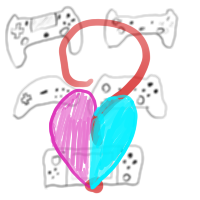

# About



[https://github.com/Vovkiv/gamepad_guesser_solution](https://github.com/Vovkiv/gamepad_guesser_solution)

---

Guess gamepad type like a pro, implementation of gamepads_types_database for Love2D.

---

This library is simple implementation of [this](https://github.com/Vovkiv/gamepads_types_database) database which should (hopefully) make guessing of gamepad types for showing correct promts much easier!

But be aware, that this is rather simple and unassuming implementation. All this codebase boils down to pretty much big for loop that traverses database to give you correct gamepad type and couple of helper functions (like function to get amount of gamepads in database) and that's it. There not specific optimizations in place. So if you tight on performance/memory/etc, then you might look lower to see other similiar libraries or implement this database yourself.

---

Other similar gamepad guesser libraries that you might want to look into:

* [GamepadGuesser, by idbrii](https://github.com/idbrii/love-gamepadguesser)

# Short video demonstration


# Basic setup
>[!NOTE]
> Before continuing, you need to actually get copy of database file. Download it here [https://github.com/Vovkiv/gamepads_types_database/blob/main/gamecontrollerdb.csv](https://github.com/Vovkiv/gamepads_types_database/blob/main/gamecontrollerdb.csv) and place in root folder of your project (or place it somewhere else, but then you need to pass path to database to load function).

```lua
local ggs = require("gamepad_guesser_solution")
-- Function that will actually load database file and will do some self tests on it. 
-- You can optionally pass path (this is pretty much just wrapper for require() ) to ftcsv library  and
-- to database file (love.filesystem.read will be used for this)
-- in case if you want to store them somewhere else.
-- If nothing passed, then default path will be used.
ggs.load_database("ftcsv", "/gamecontrollerdb.csv")

-- Now, let's try to guess first connected gamepad via GUID.
local gamepad_type, success = gamepad_guesser_solution.guess_gamepad_by_guid(love.joystick.getJoysticks()[1]:getGUID())
-- If everything is correct, gamepad_type will be something like "SonyPS4".
if not success then
-- In case if it doesn't, then fallback type will be used.
-- But we still can try to guess type by name as last resort.
gamepad_type, success = gamepad_guesser_solution.guess_gamepad_by_name(love.joystick.getJoysticks()[1]:getName())
-- And even if this will fail, welp, sorry, seems database lack your gamepad!
-- Please, report this to database repo!
end

print(gamepad_type)
```

# Examples
You can found some more elaborated examples in [examples](/examples/) directory of this repo.

Or this [main.lua](/main.lua). This is terminal-only example, and can be considered as test file to check if all functions work correctly.

# Older versions
You can found older versions in [history](/history/) directory of repo or in releases tab of repo.

# Documentation
All documentation that you need is in library [file](/gamepad_guesser_solution.lua) itself. It is just under ~500 lines of code, and generally simple to understand (I hope it is...).

# Games made using this library
None currently.

If you made game/program using this library, fell free to ask via [contacts](#contacts) to add your game in this list.

# Credits
This library/implementation won't be possible without:

---

[ftcsv.lua](https://github.com/FourierTransformer/ftcsv) - CSV library for Lua

```license
The MIT License (MIT)

Copyright (c) 2016-2023 Shakil Thakur

Permission is hereby granted, free of charge, to any person obtaining a copy
of this software and associated documentation files (the "Software"), to deal
in the Software without restriction, including without limitation the rights
to use, copy, modify, merge, publish, distribute, sublicense, and/or sell
copies of the Software, and to permit persons to whom the Software is
furnished to do so, subject to the following conditions:

The above copyright notice and this permission notice shall be included in all
copies or substantial portions of the Software.

THE SOFTWARE IS PROVIDED "AS IS", WITHOUT WARRANTY OF ANY KIND, EXPRESS OR
IMPLIED, INCLUDING BUT NOT LIMITED TO THE WARRANTIES OF MERCHANTABILITY,
FITNESS FOR A PARTICULAR PURPOSE AND NONINFRINGEMENT. IN NO EVENT SHALL THE
AUTHORS OR COPYRIGHT HOLDERS BE LIABLE FOR ANY CLAIM, DAMAGES OR OTHER
LIABILITY, WHETHER IN AN ACTION OF CONTRACT, TORT OR OTHERWISE, ARISING FROM,
OUT OF OR IN CONNECTION WITH THE SOFTWARE OR THE USE OR OTHER DEALINGS IN THE
SOFTWARE.
```

---

[gamepads_types_database](https://github.com/Vovkiv/gamepads_types_database) - by Volkov (me!)
```license
MIT No Attribution

Copyright 2024 volkov

Permission is hereby granted, free of charge, to any person obtaining a copy of this
software and associated documentation files (the "Software"), to deal in the Software
without restriction, including without limitation the rights to use, copy, modify,
merge, publish, distribute, sublicense, and/or sell copies of the Software, and to
permit persons to whom the Software is furnished to do so.

THE SOFTWARE IS PROVIDED "AS IS", WITHOUT WARRANTY OF ANY KIND, EXPRESS OR IMPLIED,
INCLUDING BUT NOT LIMITED TO THE WARRANTIES OF MERCHANTABILITY, FITNESS FOR A
PARTICULAR PURPOSE AND NONINFRINGEMENT. IN NO EVENT SHALL THE AUTHORS OR COPYRIGHT
HOLDERS BE LIABLE FOR ANY CLAIM, DAMAGES OR OTHER LIABILITY, WHETHER IN AN ACTION
OF CONTRACT, TORT OR OTHERWISE, ARISING FROM, OUT OF OR IN CONNECTION WITH THE
SOFTWARE OR THE USE OR OTHER DEALINGS IN THE SOFTWARE.
```


# Announces
I will post announces when new update will be dropped [here, LINK IS NOT YET AVALIABLE]() or will create new release here on GitHub.

# Contacts
If you have any questions about this library, have ideas, etc, you can contact me via:

* [Submit new issue](https://github.com/Vovkiv/gamepad_guesser_solution/issues/new).
* [Check discussions](https://github.com/Vovkiv/gamepad_guesser_solution/discussions/1).
* [love forum, NOT YET AVALIABLE]().
* [matrix](https://matrix.to/#/@vovkiv:matrix.org).
* Email - `volkovissocool@gmail.com`